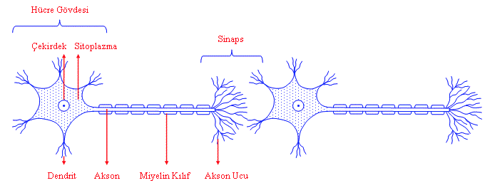

# Yapay Zeka Öğrenme Yöntemleri

* Danışmalı Öğrenme(Eğiticili)		
* Danışmasız Öğrenme(Eğiticisiz)		
* Takviyeli Öğrenme(Yarı Danışmalı)
* Çevrimiçi(Sürekli/Dinamik/Online) Eğitim
* Çevrimdışı(Statik/En az bir defa veya birden fazla araklıklı) Eğitim	

#### Danışmanlı(Eğiticili) Öğrenme

* Modellenen probleme ait örnek gözlemler veri setini kullanır.
* Bağımlı değişken bir sınıf etiketi ya da numeric bir değer olabilir.
* Örnek gözlemler bağımlı veya bağımsız değişkenlerin bilgilerinin olduğu veri setidir.

##### Özet: Problemleme ait örnek durumlar üzerinden öğrenme gerçekleşir.

#### Danışmansız(Eğiticisiz) Öğrenme: 

* Eğitim süreci yoktur.
* Nesneler öz niteliklerine göre gruplandırılır.
* Bağımlı değişken(sınıf etiketi ve numeric değer) yoktur.

#### Takviyeli Öğrenme(Yarı danışmanlı): 

* Öğrenme süreci geri bildirimlerle gerçekleşir.
* Cevrimiçi öğrenme şeklinde uygulanır.
* Deneme yanılma yönetimini esas alır.
* Karma eğitim olarakta bilinir.(Hem danışmanlı hemde danışmansız öğrenmeyi içerir).

## Yapay Zeka İle Problem Modelleme Adımları

							

1. **Problemin Tanımı**

Problemin tanımı problemimizle tamamen uyumlu olmalı.

2. **Problemin Analizi**

	-Bağımlı(varsa) değişken 	| *Veri türleri 
	-Bağımsız değişken	  	| *Alabileceği (değerler/etiketler) sınır etiketleri

3-Tasarım aşaması

	-Algoritma seçimi
	-Veri Hazırlama (Veri madenciliğinde tanımlı yöntemlerin tatbik edilmesi)
	-Problemin Yapay Zeka algoritmasının geliştirilmesi

4-Deneysel Çalışma

	-Deneysel çalışma koşullarının/ayarlarının belirlenmesi
	-Test aşaması
	-Doğrulama Aşaması

BM ≡ < b1, b2, ... , bm >       |a1|a2|... |an|b1|b2|... |bm|   | a1, a2... an, b1, b2, ... , bm      |

	Bağımlı değişken       1|   					  |	  |                               | -> probleme ait t- adet örnek gözlemden oluşan veri seti

AN ≡ < a1, a2, ... , an >    ... | 						  | ≡ |                               |

	Bağımsız değişken 	   t|						  |   | at1,at2...atn, bt1,bt2,...,btm|
																	

Veri türleri--> Sürekli değerli sayısal veriler      |

			--> Ayrık değerli sayısal veriler        | Algoritma seçiminde dikkate alınması gereken 	
			--> Kategorili / Etiketli sınır verileri | hususlardan biri veri türleridir.
			--> Alfa nümerik tipli(karmaşık) veriler |

Bağımlı ve bağımsız değişkenlerin veri türlerinin incelenmesi.

	1- Bağımlı değişken yok -> Danışmansız öğrenme uygulanacak -> Kümeleme problemidir | Kümeleme algoritmaları kullanılmalı
	2- Bağımı değişken veritürü Sayısal -> Tahmin problemi | Tahmin algoritmaları kullanılmalı | Algoritma seçimi için bağımsız değişkenlerin veri türlerini incele
					Etiketli/kategorik/ayrık -> Sınıflandırma problemi -> Sınıflandırma algoritmaları kullaılmalı -> Algoritma seçimi için bağımsız değişken veri türlerine bakılmalı.
	3- Karışık tipli veriler -> Bunun için 2 a ve b(ya sayısala yada etiketli) durumuna uyarlama yapılır.

### Tahmin(prediction) 

Veriden öğrenen modellerde sistem çıkışının nicel lması durumunda kullanılan yöntemlerin ürettiği değerlerdir.-> Danışmanlı öğrenme

### Sınıflandırma(classification)

Giriş verisine ait çıkışların ntel olduğu durumlarda kullanılan yöntemlerin her veri örneğinin hangi sınıfa ait olduğunu belirlenmesi

### Tahmin ve Kestirme

İstatistikte rasgele bir değişkenin bilinmeyen bir değerinin belirlenmesi için tahmin(prediction), 
bilinmeyen bir sabitin belirlenmesi içinse kestirim (estimation) kavramlarından bahsedilir.
Çok yakın anlamları dolayısıyla bu iki terim literatürde çoğunlukla karıştırılarak aynı şeyi ifade etmede kullanılır.

* Tahmin -> değişken
* Kestirim -> parametre ait terimlerdir.

Sınıflandırma örneği -> 1 tane Bağımlı değişken var oda hastanın durumu ama 2 etiket var sağlam ve hasta

						-> 2 tane Bağımsız değişkenler X1 ve X2 dir.

### Öğrenme Kuralları

Veriden eğitim için öerilen her algoritma farklı bir öğrenme kuralı olsa da genel eğilim algoritmaları ortak özelliklerine göre gruplamak yönündedir.
Öğrenme algoritmaları dört grupta toplanabilir.

* Hebb 	
* Hopfield
* Delta  
* Kohonen

Danışmanlı veride girdi hatadır. Hatayı düzeltmeye çalışırız.
Özellik Çıkartımı

	Veriye ait olan birçok özellikten bazıları ilgili verinin kümesinin/sınıfının belirlemede önemli rol oynar.

### Veri Hazırlama

Sınıflandırma veya tahmin için problem uzayını tam olarak temsil edebilen veri kümesi hazırlamak gerekmektedir.
Cözüm için hazırlanan veri, hem eğitim hem de başarı ölçümünde kullanıldığı için genellikle ikiye ayrılır.

# Yapay Sinir Ağları (YSA)

Yapay sinir ağlar (YSA) insan beyninden esinlenmiştir.
İnsanın öğrenme sürecinin Matematiksel olarak modellenesi emeline dayanmaktadır.

### YSA Özellikleri

* Doğrusal olmama
* Bilginin saklanması
* Öğrenme
* Görülmemiş örnekler hakkında bilgi üretebilmek
* Eksik bilgi ile çalışabilme
* Örüntü ilişkilendirme ve sınıflama yapabilme
* Genelleme yapabilme
* Uyarlanabilirlik yeteneğine sahip olma
* Hata toleransına sahip olma
* Sadece nümerik bilgiler ile çalışabilme
* Donanım ve hız
* Analiz ve tasarım

### YSA Dezavantajları

* Donanıma bağlı çalışmaları
* Uygun ağ yapısının belirlenmesi
* Ağın parametre değerlerinin (öğrenme katsayısı, her katmandaki hücre sayısı, katman sayısı vb.)
* Ağın sadece nümerik olarak çalışabilmesi
* Ağın eğitilmesinin ne zaman sonlandırılacağı

### Biyolojik Sinir Sistemi

Alıcı sinirler (receptor) organizma içerisinden ya da dış ortamlardan aldıkları uyarıları, beyine bilgi ileten elektiriksel sinyallere dönüştürür.

### Biyolojik Sinir Hücresi

**Dendritler**, sinaptik sinyalleri girdi olarak almakta\
**Hücre gövdesi**, bu sinyali analog bir yöntemle işlemekte\
**Akson**, üretilen denetim sinyalleri aksonlar aracılığı ile denetlenecek hedef hücrelere iletilmektedir.\
**Sinaps** (akson uçları)

#### Bir sinir hücresi, gelen elektrik darbelerinden üç şekilde etkilenir:

* Gelen darbelerden bazısı nöronu uyarır.
* Bazısı bastırır.
* Geri kalanı da değişikliğe yol açar.

### Yapay Hücre MOdelleri

Temel bir yapay sinir ağı hücresi biyolojik olarak

- Girişler
- Ağırlıklar
- Toplama Fonksiyon
- Aktivasyon fonksiyonu
- Çıkışlar bulunur.

**Girdiler**:
Yapay sinir hücresine gelen girişler ağın öğrenmesi istenen örnekler tarafından belirlenir.
**Ağırlıklar**: Ağırlıklar bir yapay hücreye gelen **bilginin önemini** ve **hücre üzerindeki etkisini** gösterir. **Her bir giriş kendine ait bir ağırlığa sahiptir**. Ağırlıklar **pozitif, negatif, sıfır, sabit veya değişken değerler** olabilir.

#### Oluşturmak için
1. N boyutlu giriş vektörleri
2. N boyutlu ağırlık vektörleri
3. Toplama fonksiyonu bir method yapıcak giriş vektörleri ile ağırlıkları toplayacak
4. Aktivasyon fonksiyonu gerçekleştirilecek

### MLP Genel Yapay Zeka

Çizgi olarak gösterilenlere ağırlık denir.Çizgiler 0 - 1 arasındadır.1'e çok yakınsa bağlantı ağırlığının çok güçlü olduğunu gösterir.0'a yakınsa o kadar ağırlıklıkları azdır ve en sonunda 0'a yakın olan işleminler veri settinden çıkartılır. Bağlantı ağırlıkların belirlenmeside algoritma problemidir.

